# 🛒 QuicKCart – React E-Commerce App

QuicKCart is a fully functional **e-commerce web application** built with **React, Tailwind CSS, and React Router**.  
It simulates a modern online store with cart functionality, checkout flow, discount vouchers, product search, categories, pagination, and responsive design.  
The backend data is powered by the [FakeStore API](https://fakestoreapi.com/).

---

## 📑 Table of Contents
- [📦 Deployment](#-deployment)
- [✨ Features](#-features)
- [🛠️ Tech Stack](#tech-stack)
- [📸 Screenshots](#-screenshots)
- [🚀 Getting Started](#-getting-started)
- [📝 Future Improvements](#-future-improvements)

---

## 📦 Deployment
👉 [QuicKCart - Live](https://e-commerce-quic-k-cart.vercel.app/home)

This project is deployed on Vercel.

---

## ✨ Features

- **Routing with React Router** → Home, About, Products, Single Product, Cart, and Checkout pages.
- **Product Management**  
  - Fetch products from FakeStore API.  
  - View detailed single product pages.  
  - Add/remove products to cart.  
  - Quantity control inside the product / cart page.  
  - **Search bar** to quickly find products.  
  - **Category filters** for easier browsing.  
  - **Pagination** for product listing pages.  
- **Cart System**  
  - Recommended items from the same category (custom algorithm).  
  - Cart persists while navigating.  
  - Real-time quantity and subtotal calculation as well as savings voucher calculations.  
- **Checkout Flow**  
  - Protected checkout route (accessible only with items in cart).  
  - Voucher system: apply discount cards with % off.  
  - Tax calculation and final total price.  
  - "Confirm" button → generates a receipt and resets the cart.  
- **Responsive Design** → Fully optimized for **desktop and mobile** layouts.  
- **State Management** → Custom state handling logic for cart, vouchers, search, and product recommendations (no Redux needed).  

---

## 🛠️ Tech Stack

- **React** – component-based UI  
- **Tailwind CSS** – utility-first styling  
- **React Router** – client-side routing  
- **FakeStore API** – backend data source  

---

## 📸 Screenshots

Each page has both **desktop and mobile** layouts.

- **Home Page** – Welcome screen with navigation and featured content.

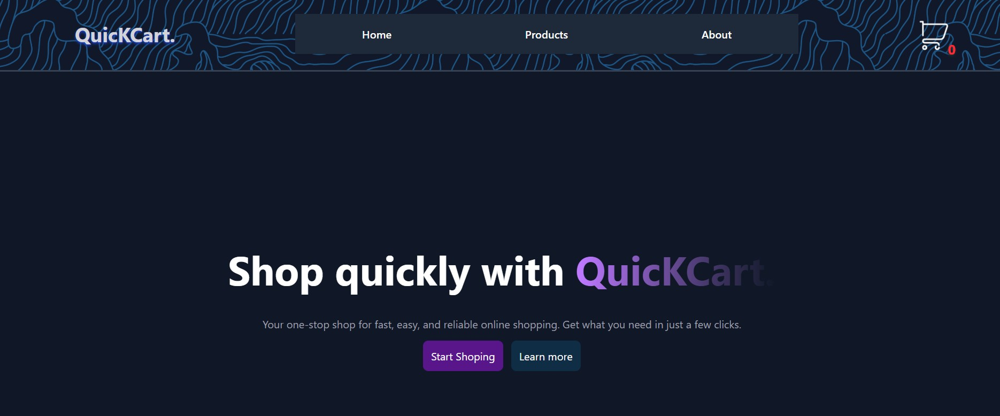
- **Home Page - Mobile** – Welcome screen with navigation and featured content.  

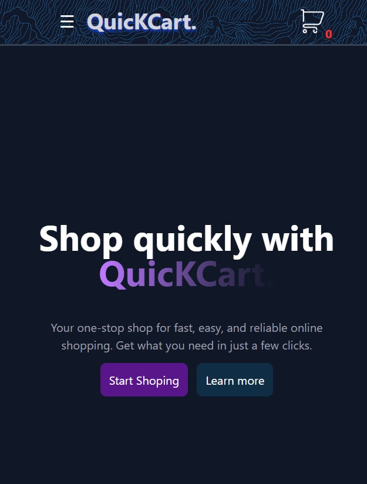

- **Footer** - Componenet for the bottom of the screen

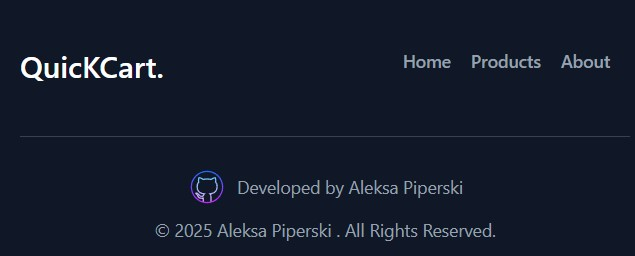

- **Hamburger Menu** - Sidebar for phone users <br>

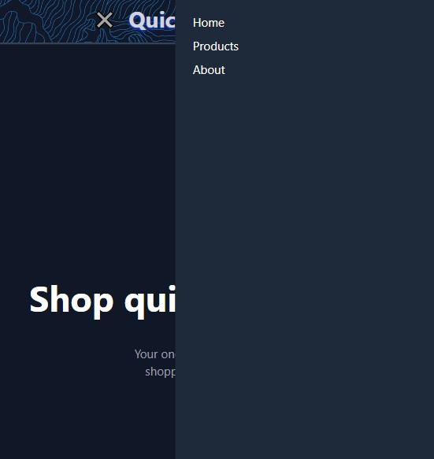

---
- **Products Page** – Browse all products with search, categories, and pagination.  

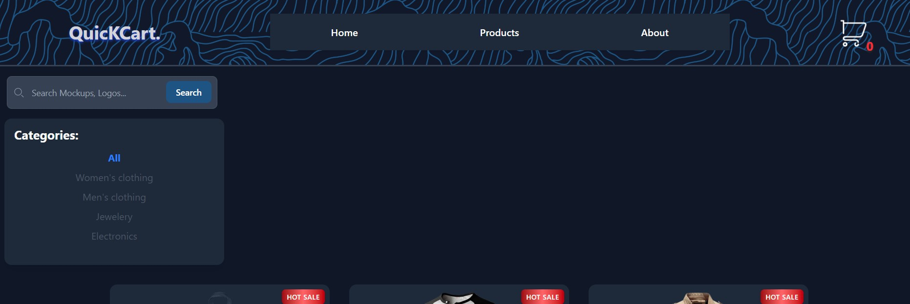

- **Products Page** – Pagination  

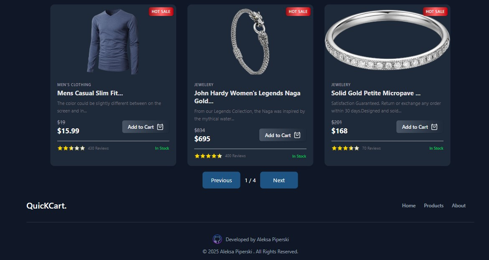

- **Products Page - Mobile** <br>  

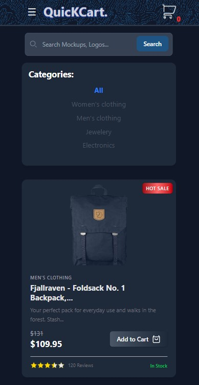

---
- **Single Product Page** – Detailed view of one product with option to add to cart.

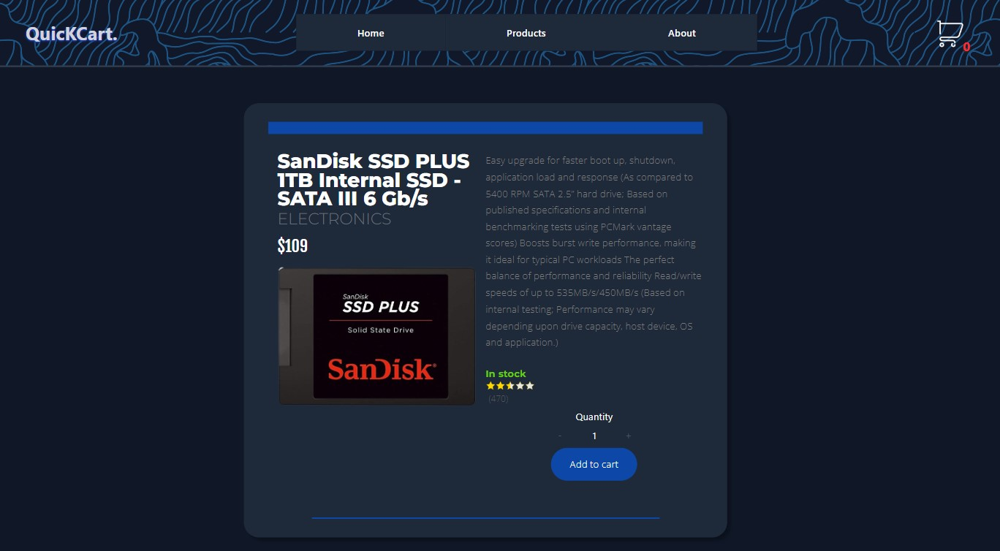  

- **Single Product Page** – Added to cart animation <br>

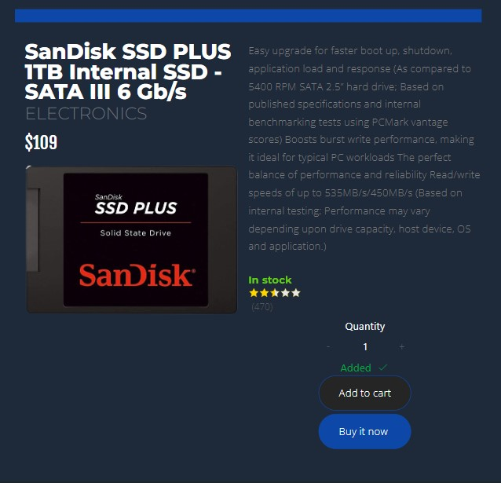  

- **Single Product Page - Mobile** <br>

 

---
- **Cart Page** – Displays selected items, quantity controls, recommended items, and subtotal.

    

---
- **Checkout Page** – Protected page showing cart summary, voucher discounts, tax, and confirmation.  

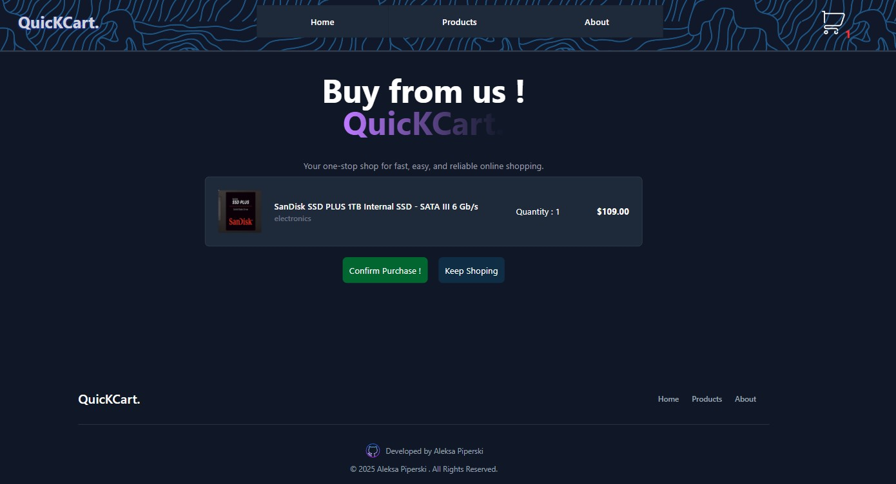 

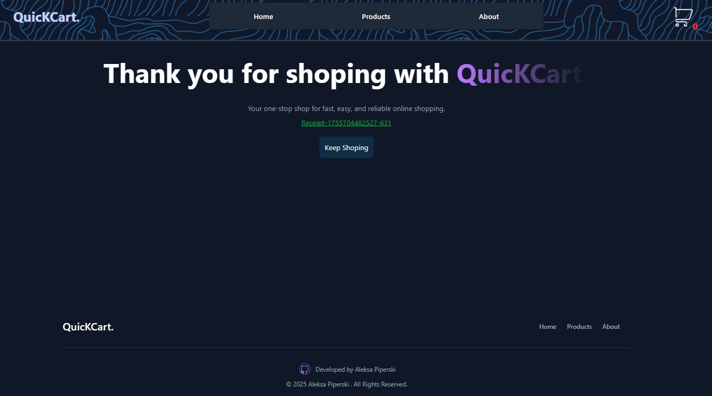  

---
- **About Page** – Information about the store. 

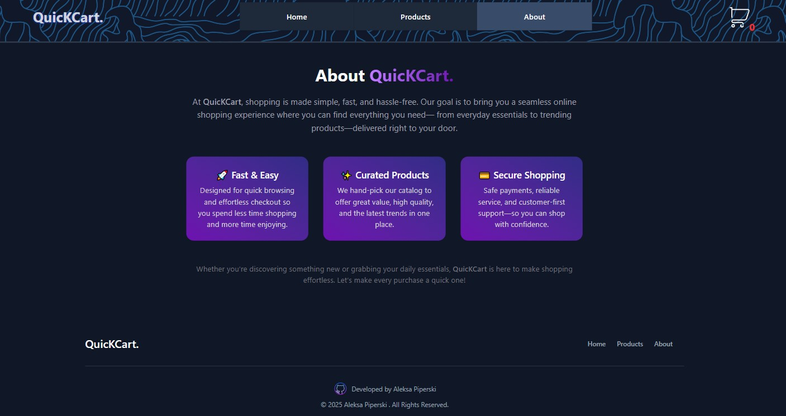

- **About Page - Mobile** <br>

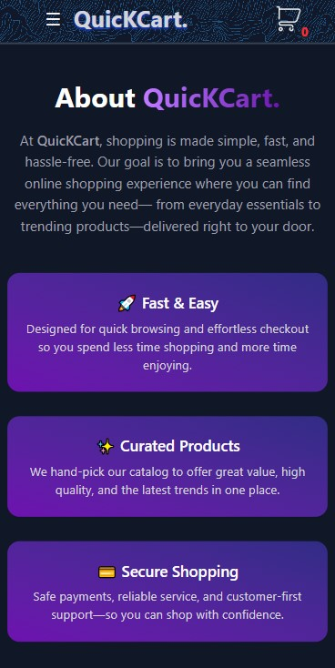   
 
---


## 🚀 Getting Started

### 1. Clone the repository
```bash
git clone https://github.com/yourusername/quickcart.git
cd quickcart
```
### 2. Install dependencies
```bash
npm install
```
### 3. Run locally
```bash
npm run dev
```

## 📝 Future Improvements
- User authentication & profile system

- Order history & persistent database

- Payment gateway integration
